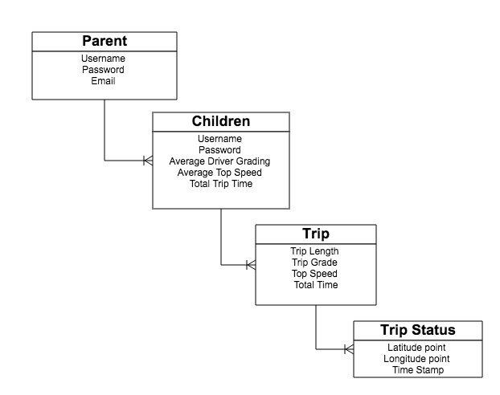
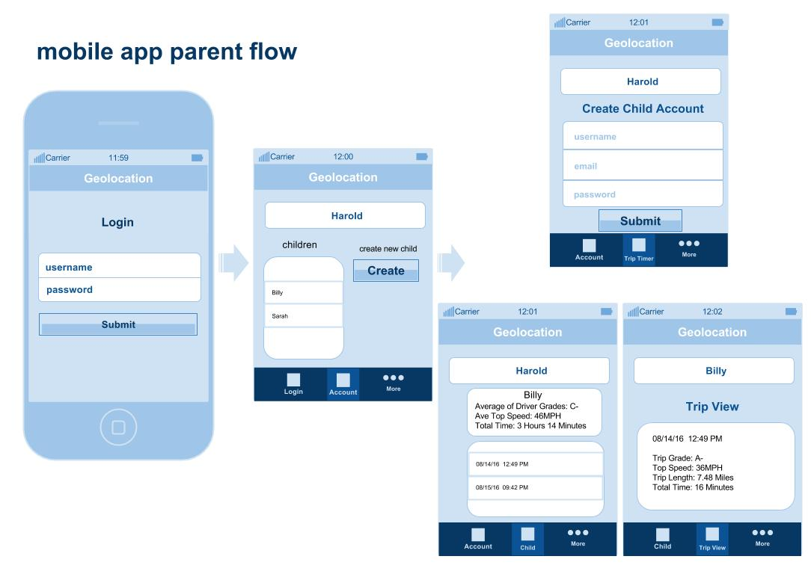
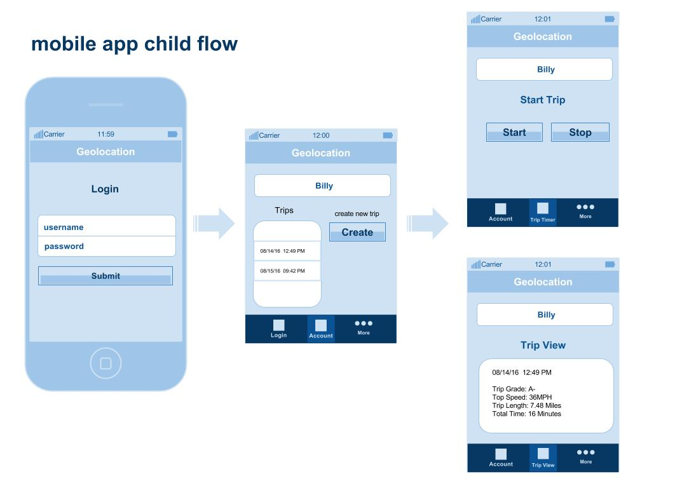

#Geolocation Teen Driver Report

### Overview

The statistics on teenage driving is very scary. From 1999 to 2006, nearly half of all teenagers who died between the ages of 12 and 19, died from unintentional injury. Nearly three quarters of those deaths were caused in auto collisions. 
 
In an age where parent always worried that their teen is driving unsafe speeds and putting their life at risk, we aim at a solution that bridges the flexablity of the web and mobile technology, with a clear look at how your child is behaving behind the wheel. 

---

### Technologies Used
- AngularJS
- Node / Express / Mongoose
- Ionic
- Cordova

---
### Approach
We envisioned a simple realtionship between parent and child and trips in order to form our models

---
### User Stories

- As a parent user I can create a parent account and add one or more children to oversee
- As a parent user, I can keep track of each child's behavior as a whole, as well as see a break down of their behavior on individual trips
- As a child user, I can log into my account, view my own trips and choose to create a new trip
- As a child user, I can press very simply press start to start recording my travel data or press stop to end the current trip

--
#WireFrames

---

######This  project  brought  to  you  by  Team  Alpha  Strike